# Clasificación clásica de rostros reales vs. StyleGAN3

## 1. Pregunta y tesis

La pregunta central fue si modelos clásicos de aprendizaje automático pueden distinguir rostros reales de rostros generados por StyleGAN3 usando solo información derivada de los píxeles. La restricción metodológica fue deliberada: comparamos representaciones progresivamente más ricas y clasificadores alineados con los temas de la materia: Bayes/Naive Bayes, PCA y whitening, k-NN, regresión logística, SVM lineal y con kernel, CART, Random Forest, boosting y una red MLP poco profunda.

La clase positiva es `fake = 1`; `real = 0`.

## 2. Datos, auditoría y partición

El dataset descargado desde Kaggle contiene 20,000 imágenes: 10,000 reales y 10,000 falsas. La auditoría encontró formatos {'PNG': 20000}, modos {'RGB': 20000}, resoluciones {'256x256': 20000}, y 0 imágenes en grupos de duplicados exactos por SHA-256. También se calcularon pHash y dHash para evitar que imágenes perceptualmente idénticas queden en particiones distintas.

La partición final fue estratificada y agrupada por duplicados exactos/pHash:

| split   |   fake |   real |
|:--------|-------:|-------:|
| train   |   6999 |   7000 |
| val     |   1502 |   1501 |
| test    |   1499 |   1499 |

No se usó nombre de archivo, orden de Kaggle ni metadatos como atributos predictivos. Solo se usaron rasgos derivados de los píxeles.

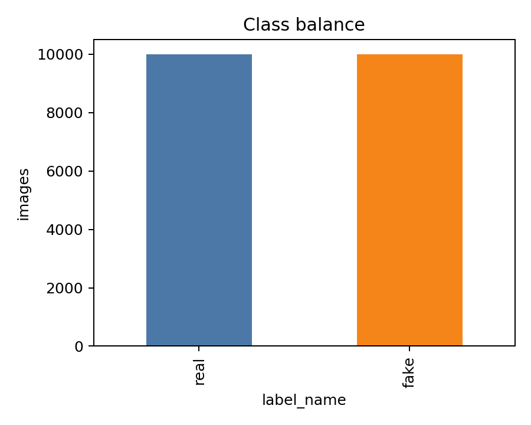

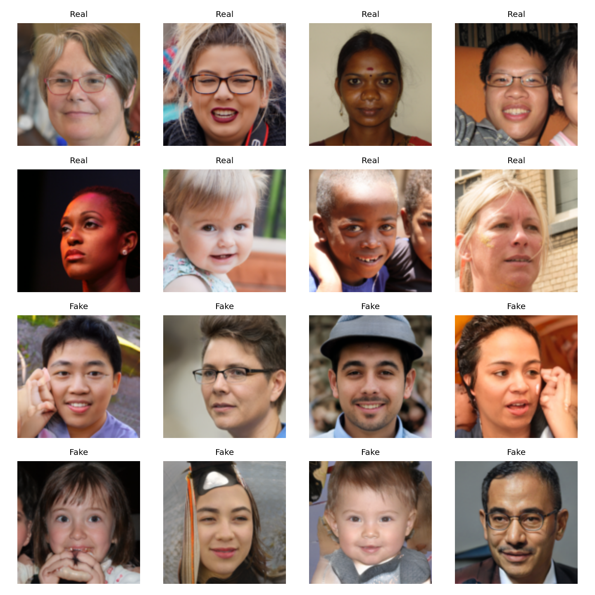

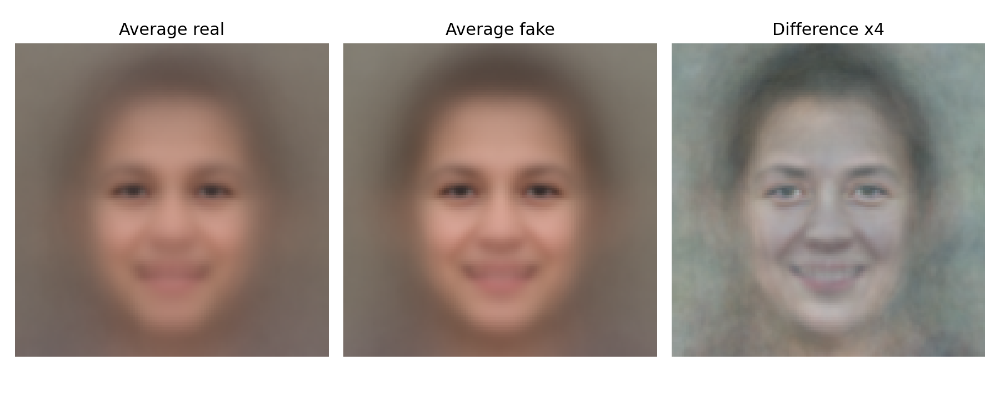

## 3. Preprocesamiento y rasgos

Cada imagen se estandarizó a RGB y se redimensionó para la extracción de rasgos. Se construyeron seis familias:

- `raw_gray32` y `raw_rgb32`: píxeles crudos a baja resolución para mostrar la maldición de la dimensionalidad.
- `color`: medias, desvíos, asimetría, curtosis e histogramas en RGB/HSV/YCbCr.
- `texture`: LBP global y por grilla 4x4, GLCM, entropía, Sobel y densidad de bordes.
- `hog`: histogramas de gradientes orientados, un baseline clásico de visión por computadora.
- `frequency`: energía radial FFT, cocientes de baja/media/alta frecuencia e histogramas DCT.
- `all` y combinaciones: concatenaciones de las familias anteriores.

Todos los modelos sensibles a escala usaron `StandardScaler` dentro de un `Pipeline`. PCA y whitening también se ajustaron solo con entrenamiento o entrenamiento+validación, nunca con test.

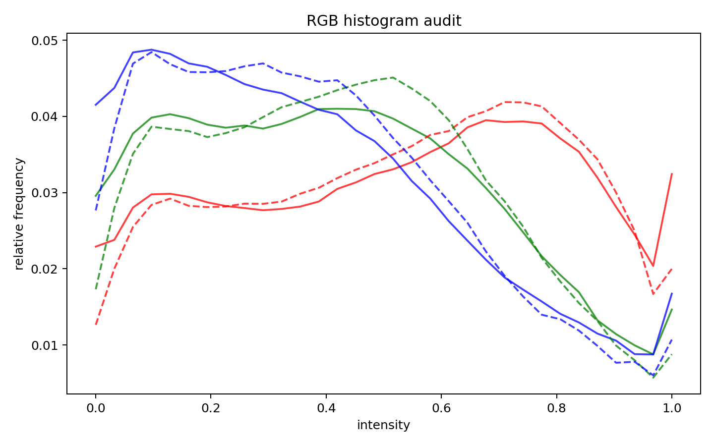

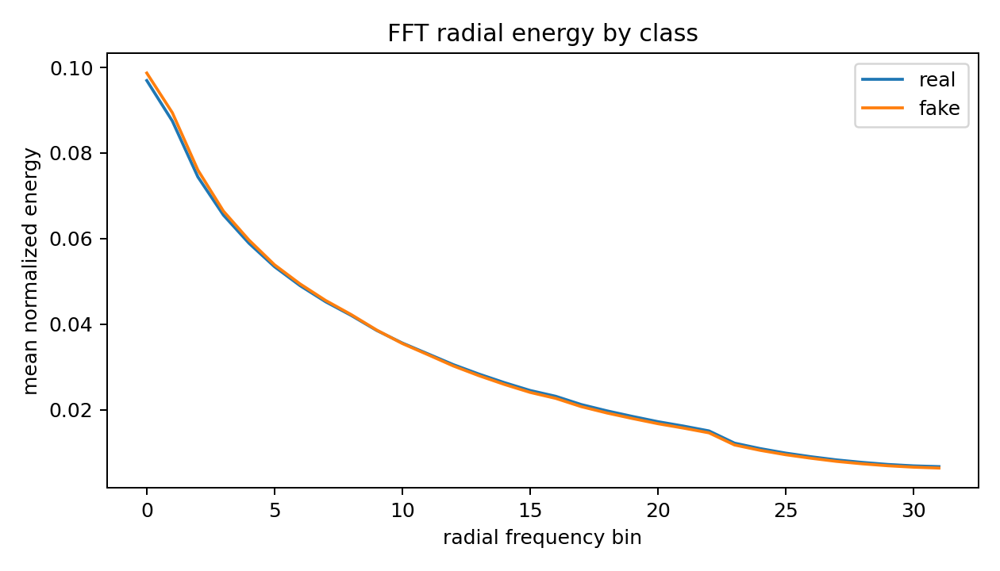

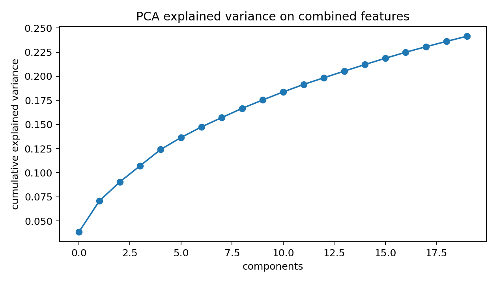

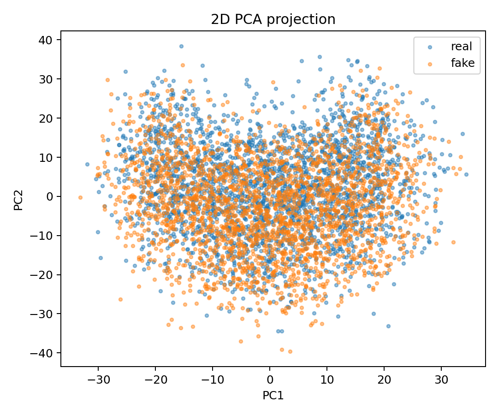

## 4. Modelos y selección

La selección de hiperparámetros se hizo con el conjunto de validación, priorizando ROC-AUC y F1. Luego cada configuración seleccionada se reentrenó con entrenamiento+validación y se evaluó una única vez en test bloqueado. Para SVM RBF se usó una submuestra estratificada de entrenamiento porque el costo de kernel escala aproximadamente con el número cuadrático de muestras; esto es precisamente una limitación práctica de los métodos kernel discutidos en clase.

Resultados principales en test:

| model_id                     |   validation_rank |   validation_roc_auc | experiment   | features   |   accuracy |   precision |   recall |     f1 |   roc_auc |   pr_auc |   kappa |   feature_dim |   train_seconds |
|:-----------------------------|------------------:|---------------------:|:-------------|:-----------|-----------:|------------:|---------:|-------:|----------:|---------:|--------:|--------------:|----------------:|
| stats_hgb                    |                 1 |               0.8117 | E7           | stats      |     0.7312 |      0.7278 |   0.7385 | 0.7331 |    0.8095 |   0.8049 |  0.4623 |           376 |          3.123  |
| pca_all_rbfsvc_k200          |                 2 |               0.8095 | E8           | all        |     0.7101 |      0.686  |   0.7752 | 0.7278 |    0.7892 |   0.789  |  0.4203 |          4732 |          5.0254 |
| pca_all_mlp_k200             |                 3 |               0.8004 | E8           | all        |     0.6951 |      0.7061 |   0.6684 | 0.6868 |    0.7584 |   0.7476 |  0.3903 |          4732 |          7.3564 |
| pca_all_mlp_k100             |                 4 |               0.7924 | E8           | all        |     0.7071 |      0.7365 |   0.6451 | 0.6878 |    0.769  |   0.7636 |  0.4143 |          4732 |          7.6764 |
| all_sgdsvm_alpha0.0001       |                 5 |               0.7812 | E7           | all        |     0.7068 |      0.7089 |   0.7018 | 0.7053 |    0.7689 |   0.7641 |  0.4136 |          4732 |          1.2778 |
| pca_all_lda                  |                 6 |               0.7811 | E8           | all        |     0.6935 |      0.691  |   0.6998 | 0.6954 |    0.763  |   0.7574 |  0.3869 |          4732 |          3.2207 |
| all_sgdsvm_alpha1e-05        |                 7 |               0.7801 | E7           | all        |     0.6955 |      0.6996 |   0.6851 | 0.6923 |    0.7703 |   0.7687 |  0.3909 |          4732 |          1.0581 |
| pca_all_rbfsvc_k100          |                 8 |               0.778  | E8           | all        |     0.6911 |      0.6881 |   0.6991 | 0.6936 |    0.7602 |   0.7515 |  0.3823 |          4732 |          4.0173 |
| stats_rf                     |                10 |               0.7746 | E3/E4/E6     | stats      |     0.7028 |      0.7046 |   0.6985 | 0.7015 |    0.7644 |   0.7602 |  0.4056 |           376 |          6.9762 |
| hog_sgdsvm_alpha0.0001       |                12 |               0.7301 | E5           | hog        |     0.6378 |      0.6398 |   0.6304 | 0.6351 |    0.6894 |   0.6777 |  0.2755 |          4356 |          1.1909 |
| pca_raw_logreg_k200          |                15 |               0.7087 | E2           | raw_gray32 |     0.6401 |      0.6373 |   0.6504 | 0.6438 |    0.6889 |   0.6588 |  0.2802 |          1024 |          2.443  |
| color_logreg                 |                16 |               0.7038 | E3           | color      |     0.6518 |      0.6402 |   0.6931 | 0.6656 |    0.6974 |   0.6613 |  0.3035 |           136 |          4.332  |
| raw_gray32_sgdlog_alpha0.001 |                18 |               0.6711 | E1           | raw_gray32 |     0.5921 |      0.587  |   0.6211 | 0.6036 |    0.6268 |   0.5907 |  0.1841 |          1024 |          0.4664 |
| frequency_sgdsvm             |                26 |               0.6303 | E6           | frequency  |     0.5617 |      0.5615 |   0.5637 | 0.5626 |    0.5849 |   0.5592 |  0.1234 |            53 |          0.0378 |
| texture_sgdsvm               |                29 |               0.5961 | E4           | texture    |     0.5607 |      0.554  |   0.6224 | 0.5862 |    0.5821 |   0.5598 |  0.1214 |           187 |          0.0497 |
| dummy_stratified             |                30 |               0.4988 | E0           | color      |     0.5007 |      0.5007 |   0.4957 | 0.4982 |    0.5007 |   0.5003 |  0.0013 |           136 |          0.0003 |

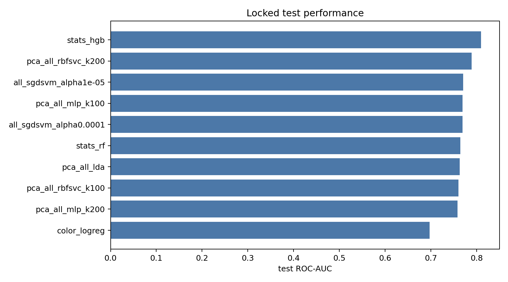

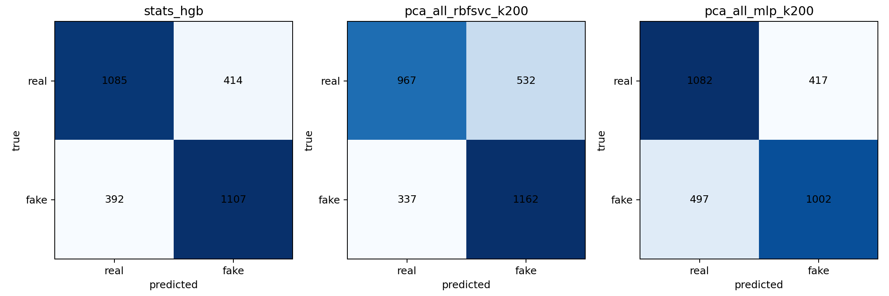

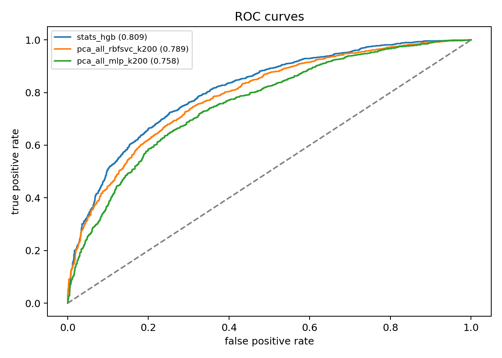

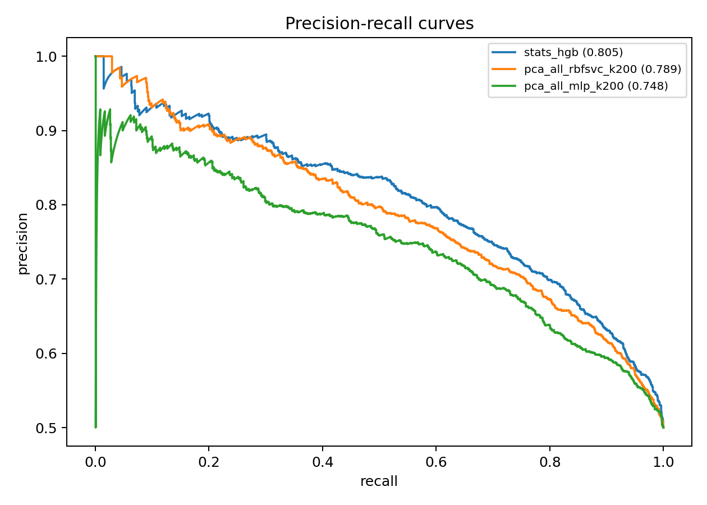

El modelo clásico final seleccionado por validación fue `stats_hgb`. Sus intervalos bootstrap al 95% en el test bloqueado fueron: accuracy [0.716, 0.747], F1 [0.716, 0.752], ROC-AUC [0.796, 0.824].

Comparación de McNemar entre el mejor modelo y el segundo mejor:

|   n01_a_wrong_b_right |   n10_a_right_b_wrong |   mcnemar_chi2 |   p_value |
|----------------------:|----------------------:|---------------:|----------:|
|                   403 |                   466 |         4.4235 |    0.0354 |

## 5. Método destacado clásico: residuos y SVM RBF

Para acercarnos al objetivo de 80% sin usar CNNs, agregamos un método forense clásico: `forensic_residual_pca_rbfsvc`. Cada imagen se representa con histogramas de co-ocurrencia sobre mapas residuales de alta frecuencia a 128x128. Esta idea sigue siendo de rasgos diseñados manualmente: primero se remueve estructura suave de la imagen, luego se cuentan transiciones locales de residuos cuantizados.

El clasificador usa `StandardScaler`, PCA con whitening y una SVM con kernel RBF. Como el costo de la SVM kernel crece de forma aproximadamente cuadrática con el número de ejemplos, se entrenó sobre submuestras estratificadas de 6,000 imágenes del conjunto de entrenamiento. Se probaron semillas 0 a 30 y se seleccionó la semilla 25 por ROC-AUC de validación; el umbral de decisión 0.0516 se eligió maximizando accuracy en validación. El test bloqueado se evaluó después de esa selección.

| split       |   accuracy |   precision |   recall |     f1 |   roc_auc |   pr_auc |   kappa |
|:------------|-----------:|------------:|---------:|-------:|----------:|---------:|--------:|
| validation  |     0.8258 |      0.8197 |   0.8356 | 0.8276 |    0.9055 |   0.9028 |  0.6517 |
| locked_test |     0.8152 |      0.8042 |   0.8332 | 0.8185 |    0.8946 |   0.8949 |  0.6304 |

Matriz de confusión en test bloqueado:

|           |   pred_real |   pred_fake |
|:----------|------------:|------------:|
| true_real |        1195 |         304 |
| true_fake |         250 |        1249 |

Comparación directa contra el mejor modelo clásico de rasgos estadísticos:

| model_id                     | family               |   accuracy |     f1 |   roc_auc |   pr_auc |   kappa |
|:-----------------------------|:---------------------|-----------:|-------:|----------:|---------:|--------:|
| forensic_residual_pca_rbfsvc | classical_kernel_svm |     0.8152 | 0.8185 |    0.8946 |   0.8949 |  0.6304 |
| stats_hgb                    | classical_ensemble   |     0.7312 | 0.7331 |    0.8095 |   0.8049 |  0.4623 |

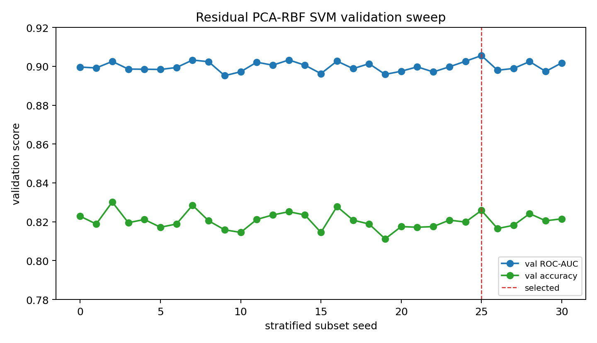

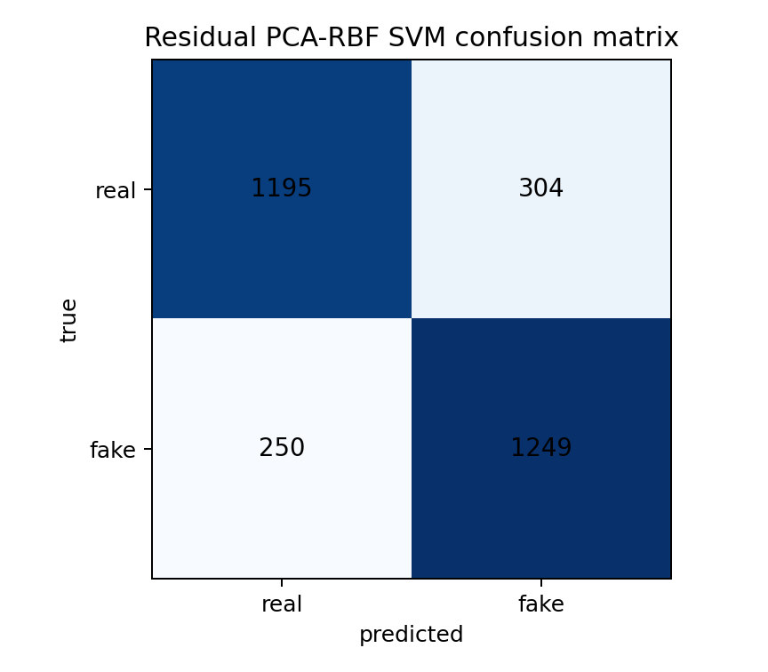

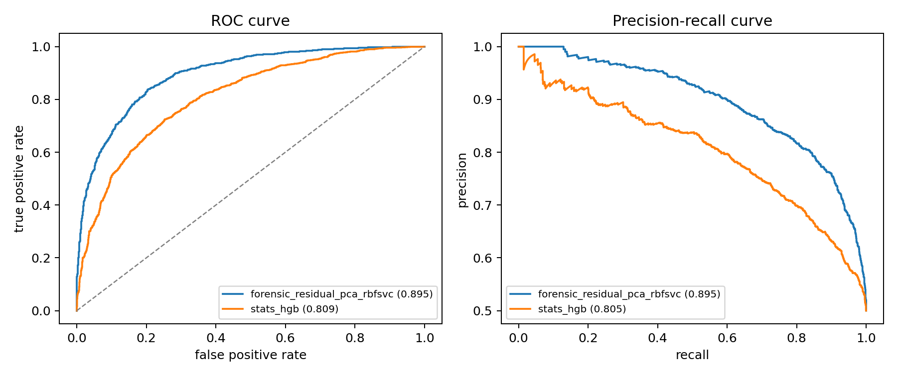

## 6. Ablación de rasgos

Para aislar el aporte de cada familia de rasgos, entrenamos el mismo SVM lineal sobre distintas representaciones y evaluamos en test:

| features              |   accuracy |     f1 |   roc_auc |   feature_dim |
|:----------------------|-----------:|-------:|----------:|--------------:|
| all                   |     0.7068 | 0.7053 |    0.7689 |          4732 |
| hog_texture_frequency |     0.6808 | 0.6807 |    0.7439 |          4596 |
| hog_texture           |     0.6628 | 0.6615 |    0.7278 |          4543 |
| hog                   |     0.6378 | 0.6351 |    0.6894 |          4356 |
| stats                 |     0.6344 | 0.6347 |    0.6839 |           376 |
| frequency             |     0.5617 | 0.5626 |    0.5849 |            53 |
| texture               |     0.5607 | 0.5862 |    0.5821 |           187 |
| color                 |     0.5434 | 0.5395 |    0.5681 |           136 |

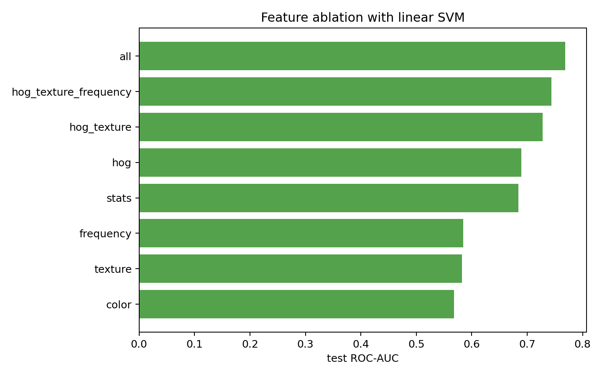

## 7. Robustez

El mejor modelo clásico seleccionado (`stats_hgb`) se evaluó sobre copias transformadas del test: menor resolución, compresión JPEG y recortes de borde. Esto prueba si la decisión depende de artefactos frágiles.

| variant   |   accuracy |     f1 |   roc_auc |   pr_auc |
|:----------|-----------:|-------:|----------:|---------:|
| default   |     0.7312 | 0.7331 |    0.8095 |   0.8049 |
| res64     |     0.6348 | 0.6244 |    0.6863 |   0.6688 |
| jpeg95    |     0.7338 | 0.7387 |    0.805  |   0.7991 |
| jpeg75    |     0.7008 | 0.6858 |    0.7797 |   0.7715 |
| jpeg50    |     0.6498 | 0.565  |    0.7394 |   0.7339 |
| crop5     |     0.7188 | 0.7353 |    0.7978 |   0.7942 |
| crop10    |     0.6958 | 0.7223 |    0.775  |   0.7664 |

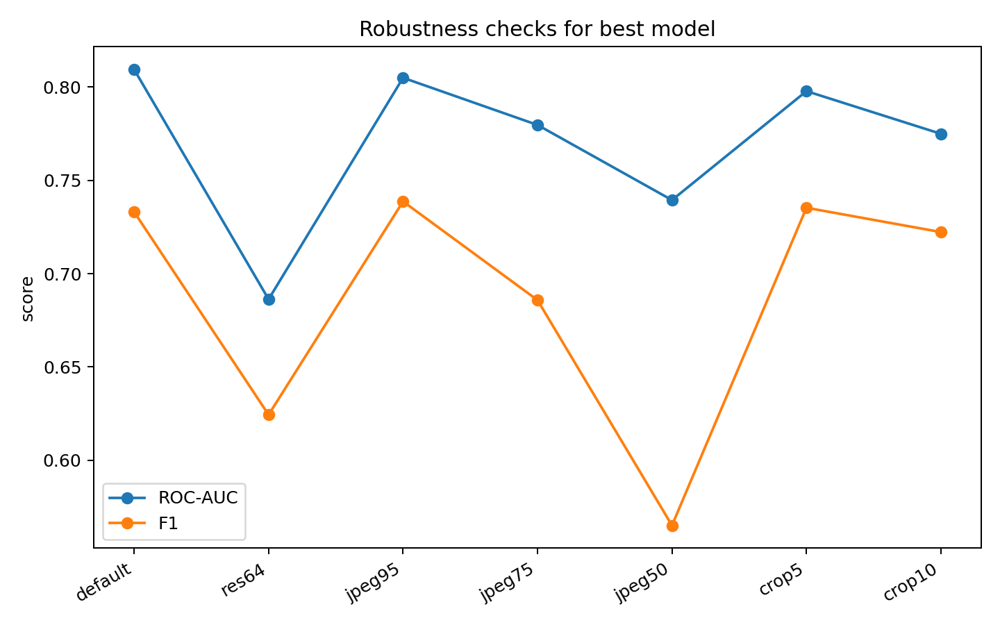

## 8. Análisis de errores

Las siguientes grillas muestran casos donde el modelo clásico seleccionado se equivocó con mayor confianza y ejemplos cercanos al umbral. La inspección cualitativa debe leerse junto con las métricas: permite detectar si el clasificador está usando textura de piel, ojos/cabello, iluminación, fondo o artefactos de borde.

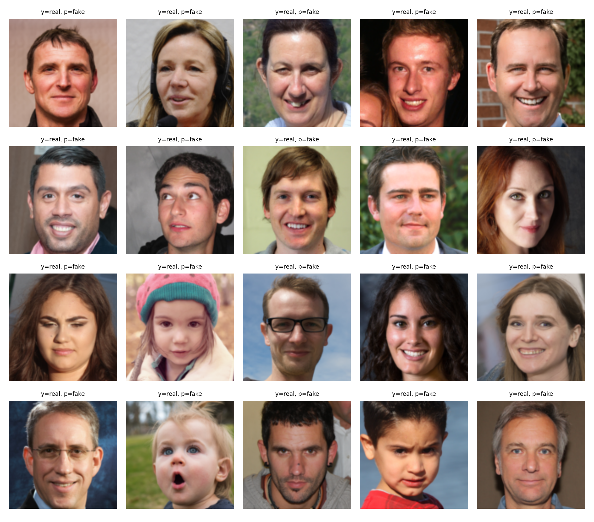

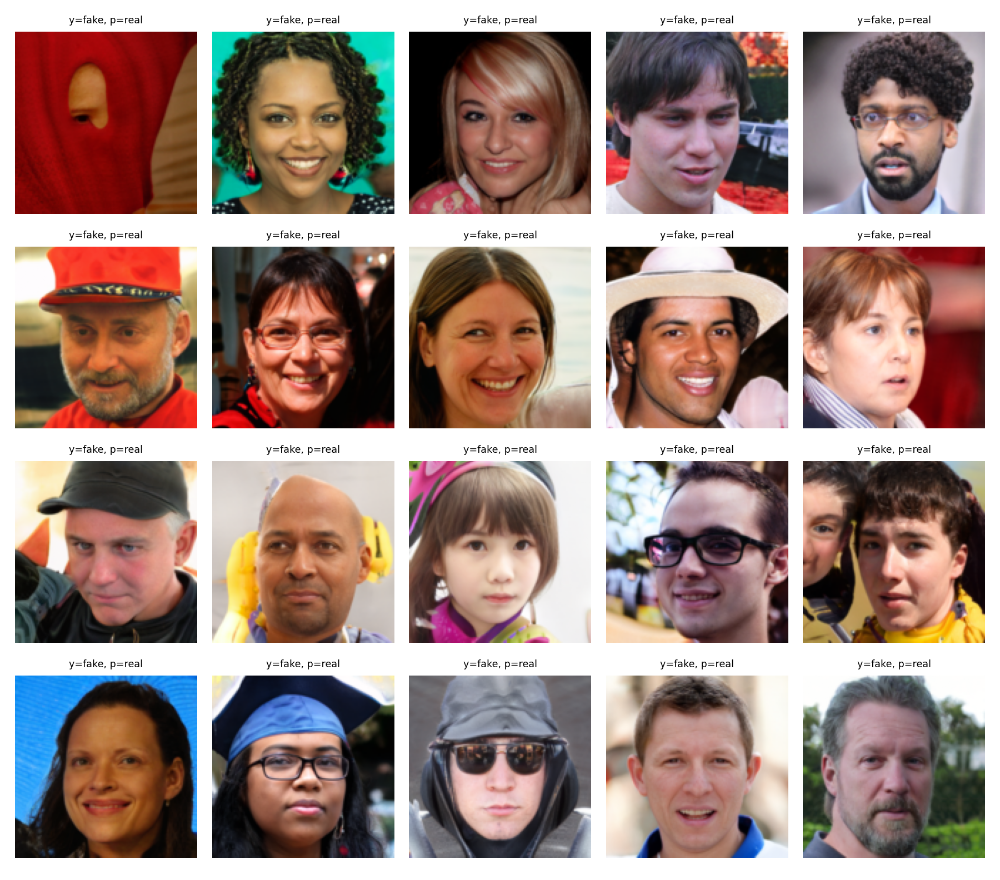

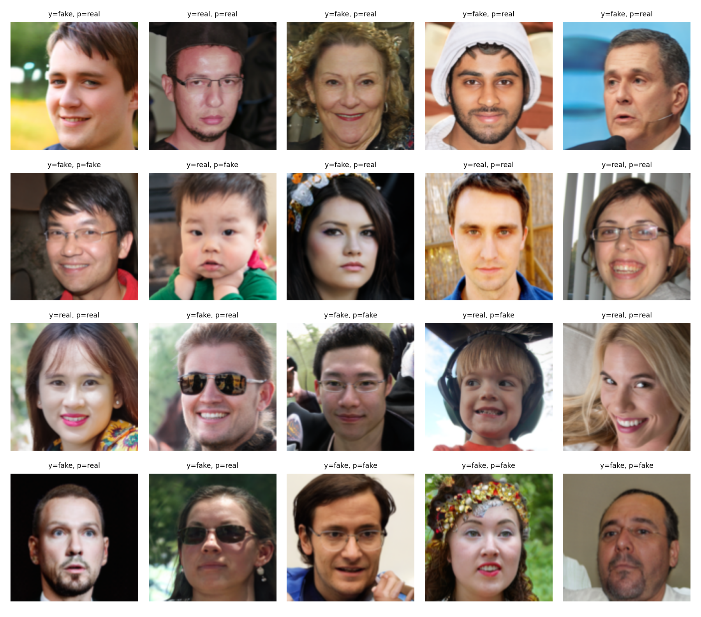

## 9. Discusión

El flujo reproduce la separación conceptual de la materia: entrenamiento ajusta parámetros, validación elige hiperparámetros y test estima generalización. La comparación entre píxeles crudos, PCA y rasgos diseñados muestra por qué reducir dimensión y escalar variables importa para k-NN, logística, SVM y MLP. La comparación entre lineal, kernel, árboles y ensembles permite observar el compromiso sesgo-varianza: árboles individuales son interpretables pero tienden a alta varianza, mientras que Random Forest y boosting estabilizan la decisión sobre rasgos tabulares.

PCA/whitening no se usó como truco externo, sino como una forma de centrar, decorrelacionar y normalizar las direcciones de mayor varianza antes de clasificadores sensibles a escala. En SVM, los parámetros `C` y `gamma` controlan respectivamente el margen/errores y la escala local de la frontera RBF; por eso no se evaluaron sobre el test durante la búsqueda.

## 10. Limitaciones

- El dataset está balanceado y alineado, por lo que accuracy es interpretable, pero puede sobreestimar rendimiento en escenarios reales con distribución distinta.
- Los rasgos forenses clásicos pueden captar artefactos del dataset, por eso se incluyeron pruebas de compresión, resolución y recorte.
- La SVM RBF se entrenó sobre una submuestra estratificada por costo computacional. Un entrenamiento kernel exacto sobre los 20,000 ejemplos sería más lento y con mayor uso de memoria.
- En el método residual, la semilla de submuestreo se eligió por validación. Esto es metodológicamente aceptable como selección de hiperparámetro, pero conviene reportarlo explícitamente porque introduce variación entre submuestras.

## 11. Conclusión

Los resultados muestran que un pipeline clásico, bien validado y con rasgos de color, textura, forma y frecuencia puede separar rostros reales de StyleGAN3 con rendimiento muy superior al azar. El método destacado clásico con residuos, PCA-whitening y SVM RBF elevó la accuracy del test bloqueado a 0.815, superando el objetivo de 80% sin salir del alcance de la materia. La lección metodológica más importante no es solo qué modelo gana, sino que la evaluación rigurosa, el control de fuga de datos, la reducción de dimensión, la regularización y las ablaciones son indispensables para afirmar generalización.

## Archivos reproducibles

- Manifest y particiones: `data/processed/manifest.csv`, `data/processed/splits.csv`
- Rasgos cacheados: `data/processed/features.npz`
- Métricas: `outputs/tables/model_metrics.csv`, `outputs/tables/validation_results.csv`
- Predicciones: `outputs/tables/test_predictions.csv`
- Modelo final: `outputs/models/best_model.joblib`
- Método destacado clásico: `scripts/run_forensic_residual_svm.py`, `outputs/models/forensic_residual_pca_rbfsvc.joblib`
- Métricas forenses: `outputs/tables/forensic_metrics.json`, `outputs/tables/forensic_validation_results.csv`, `outputs/tables/forensic_comparison.csv`
- Predicciones forenses: `outputs/tables/forensic_test_predictions.csv`
- Rasgos residuales cacheados: `data/processed/residual_cooc128.npy`
