# Clasificación de rostros reales y generados

## Resumen

El trabajo plantea un problema de aprendizaje supervisado binario: dada una imagen de un rostro, predecir si pertenece a la clase **real** o a la clase **generada**. La clase positiva para las métricas es **generada**.

El mejor resultado se obtuvo con una SVM con kernel RBF, después de estandarizar las variables, proyectarlas con PCA con whitening y entrenar sobre variables construidas a partir de diferencias locales entre píxeles. En el conjunto de test final alcanzó:

| Métrica | Valor |
| --- | ---: |
| Accuracy | 0.821 |
| Precision | 0.824 |
| Recall | 0.815 |
| F1 | 0.820 |
| ROC-AUC | 0.905 |
| PR-AUC | 0.907 |
| Kappa | 0.641 |

La mejora principal aparece al cambiar la representación de las imágenes: las variables basadas en diferencias locales entre píxeles capturan mejor la señal útil que las variables generales de color, textura, gradientes y frecuencia.

## Datos

El dataset contiene **20.000 imágenes RGB** de rostros, todas en formato PNG, de tamaño **256 x 256** y sin EXIF. Las clases están balanceadas: 10.000 imágenes reales y 10.000 imágenes generadas.

La partición usada fue estratificada, manteniendo prácticamente la misma proporción de clases en entrenamiento, validación y test:

| Partición | Real | Generada | Total |
| --- | ---: | ---: | ---: |
| Entrenamiento | 7.000 | 6.999 | 13.999 |
| Validación | 1.501 | 1.502 | 3.003 |
| Test | 1.499 | 1.499 | 2.998 |

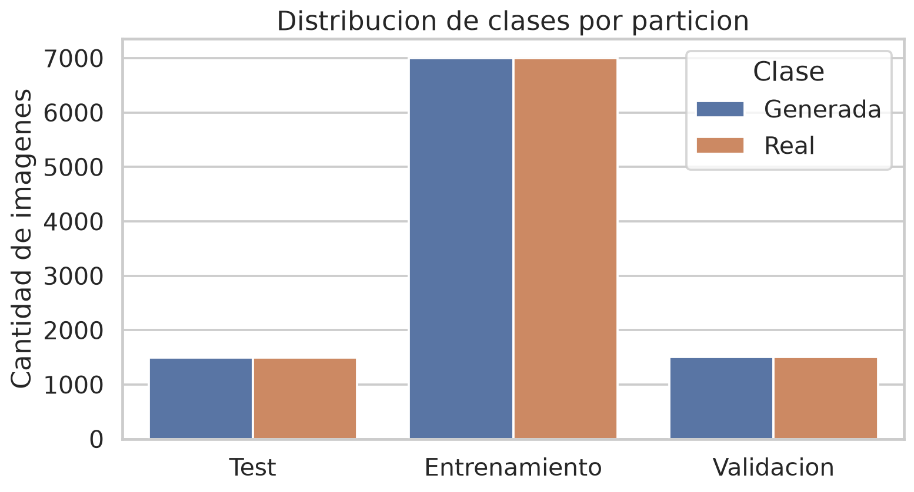

Antes de entrenar, se calcularon hashes SHA-256 de las imágenes. No se encontraron duplicados. Las rutas, carpetas y nombres de archivo se usaron solo para ubicar las imágenes y asignar la etiqueta; no entraron como variables del modelo.

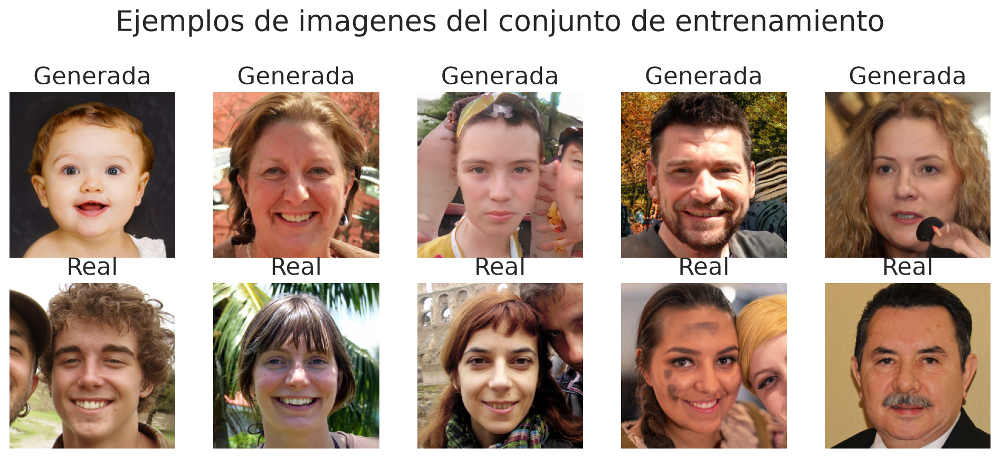

## Flujo de trabajo

El pipeline sigue la estructura usual de un proyecto de ciencia de datos:

1. **Recolección de datos.** Se parte del dataset de rostros reales y rostros generados por StyleGAN3.
2. **Limpieza y preprocesamiento.** Se normalizan las imágenes a RGB, se redimensionan para construir variables comparables y se guarda una partición fija en entrenamiento, validación y test.
3. **EDA.** Se revisan cantidades por clase, tamaño de imagen, canales, formato y duplicados. El dataset queda balanceado y sin duplicados exactos.
4. **Construcción de variables.** Se transforman los píxeles en varias representaciones numéricas.
5. **Modelado.** Se entrenan clasificadores supervisados y se selecciona el modelo usando validación.
6. **Evaluación final.** El conjunto de test se usa una sola vez para estimar generalización.

## Variables construidas

Se probaron varias familias de variables:

| Familia de variables | Dimensión |
| --- | ---: |
| Color | 136 |
| Textura | 187 |
| Gradientes HOG | 4.356 |
| Frecuencia | 53 |
| Píxeles en gris 32 x 32 | 1.024 |
| Píxeles RGB 32 x 32 | 3.072 |
| Diferencias locales de píxeles | 9.072 |

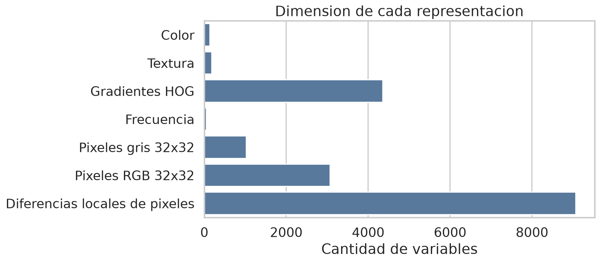

Las primeras familias resumen propiedades generales:

- **Color:** medias, desvíos, asimetría, curtosis e histogramas en distintos espacios de color.
- **Textura:** patrones locales, co-ocurrencias de niveles de gris, bordes y entropía.
- **Gradientes HOG:** distribución de orientaciones de gradiente.
- **Frecuencia:** energía en bandas del espectro y coeficientes de transformadas.
- **Píxeles reducidos:** intensidades directas de la imagen redimensionada.

La representación final usa **diferencias locales entre píxeles**. Para cada imagen en escala de grises se calculan diferencias horizontales, verticales, diagonales, de segundo orden y tipo Laplaciano. Luego se cuantizan esas diferencias y se cuentan co-ocurrencias dentro de una grilla de 4 x 4 celdas. El resultado es un vector de 9.072 variables.

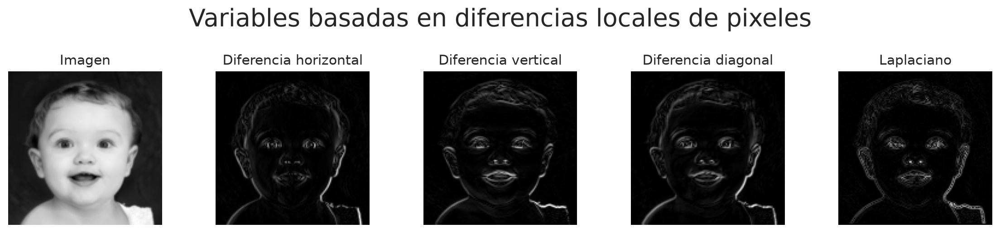

La idea de usar co-ocurrencias para detectar imágenes generadas por GAN está inspirada en Nataraj et al. (2019), *Detecting GAN generated Fake Images using Co-occurrence Matrices*. Ese trabajo propone extraer matrices de co-ocurrencia en el dominio de píxeles. Aquí se adaptó la idea a diferencias locales en escala de grises, manteniendo el enfoque de construir variables que describen relaciones entre píxeles vecinos.

Esta representación es útil porque no describe solamente el contenido visible del rostro, sino también cómo cambian los valores de píxel en vecindarios pequeños.

## Modelos

Se compararon clasificadores clásicos de aprendizaje supervisado sobre distintas representaciones de la imagen. La comparación se hizo con el conjunto de validación. El test quedó reservado para la medición final. Esto respeta la separación:

| Conjunto | Uso |
| --- | --- |
| Entrenamiento | Ajustar parámetros del modelo |
| Validación | Elegir representación, hiperparámetros y umbral |
| Test | Reportar rendimiento final |

La primera comparación incluyó 30 candidatos. Después se agregó el modelo con diferencias locales de píxeles, porque esa representación estaba motivada por las matrices de co-ocurrencia usadas para detectar imágenes generadas por GAN. En total, la tabla de validación contiene 31 filas.

### Modelos probados

| Familia | Variables | Preprocesamiento | Variantes |
| --- | --- | --- | --- |
| Baseline aleatorio estratificado | Color, solo como entrada formal | Ninguno | Predice al azar respetando proporciones de clase |
| Naive Bayes Gaussiano | Píxeles grises 32 x 32 | Ninguno | Supone variables condicionalmente independientes con distribución gaussiana |
| Regresión logística | Color; píxeles grises; píxeles grises con PCA | Estandarización; o estandarización + PCA con whitening | `max_iter=1000` para logística directa; SGD con `alpha` en 1e-3, 1e-4, 1e-5 |
| SVM lineal | Textura, frecuencia, HOG, píxeles grises, variables construidas | Estandarización | Entrenamiento con pérdida hinge y regularización L2; `alpha` en 1e-3, 1e-4, 1e-5 cuando se barrió |
| Árbol de decisión | Color + textura + frecuencia | Ninguno | Profundidad máxima 12 y mínimo 10 muestras por hoja |
| Random Forest | Color + textura + frecuencia | Ninguno | 300 árboles, subespacio `sqrt`, mínimo 2 muestras por hoja |
| Gradient Boosting | Color + textura + frecuencia | Ninguno | `learning_rate=0.06`, 180 iteraciones, máximo 31 hojas, regularización L2 0.01 |
| k-NN | Píxeles grises con PCA | Estandarización + PCA con whitening | 100 y 200 componentes; 11 vecinos con peso por distancia |
| LDA | Variables construidas con PCA | Estandarización + PCA con whitening | 100 componentes |
| QDA | Variables construidas con PCA | Estandarización + PCA con whitening | 50 componentes y regularización 0.05 |
| SVM con kernel RBF | Variables construidas con PCA | Estandarización + PCA con whitening | 100 y 200 componentes; `C=10`, `gamma=scale` |
| Red neuronal | Variables construidas con PCA | Estandarización + PCA con whitening | Capas ocultas 256 y 128, activación ReLU, early stopping |
| SVM con kernel RBF sobre diferencias locales | Diferencias locales de píxeles | Estandarización + PCA con whitening | 128 componentes, `C=3`, `gamma=scale`; umbral elegido en validación |

PCA reduce la dimensión y mejora el condicionamiento del problema, pero no garantiza por sí mismo separabilidad de clases. Por eso la decisión final se apoya en métricas de validación y test, no solo en varianza explicada o visualizaciones 2D.

### Comparación completa en validación

La siguiente tabla está ordenada por ROC-AUC en validación. Se reportan también accuracy, F1, PR-AUC y Kappa para no seleccionar mirando una sola métrica.

| Rank | Modelo | Variables | Acc. | F1 | ROC-AUC | PR-AUC | Kappa |
| ---: | --- | --- | ---: | ---: | ---: | ---: | ---: |
| 1 | SVM con PCA sobre diferencias locales de pixeles | Diferencias locales de pixeles | 0.838 | 0.837 | 0.915 | 0.915 | 0.676 |
| 2 | SVM RBF con PCA sobre variables construidas (200 comp.) | Color + textura + HOG + frecuencia | 0.752 | 0.755 | 0.831 | 0.826 | 0.503 |
| 3 | Gradient Boosting sobre estadisticos | Color + textura + frecuencia | 0.732 | 0.732 | 0.812 | 0.797 | 0.463 |
| 4 | SVM RBF con PCA sobre variables construidas (100 comp.) | Color + textura + HOG + frecuencia | 0.718 | 0.712 | 0.802 | 0.807 | 0.435 |
| 5 | Red neuronal con PCA sobre variables construidas (200 comp.) | Color + textura + HOG + frecuencia | 0.725 | 0.732 | 0.800 | 0.794 | 0.449 |
| 6 | Red neuronal con PCA sobre variables construidas (100 comp.) | Color + textura + HOG + frecuencia | 0.720 | 0.721 | 0.792 | 0.786 | 0.441 |
| 7 | SVM lineal sobre variables construidas (alpha=1e-4) | Color + textura + HOG + frecuencia | 0.703 | 0.699 | 0.781 | 0.778 | 0.406 |
| 8 | LDA con PCA sobre variables construidas | Color + textura + HOG + frecuencia | 0.720 | 0.722 | 0.781 | 0.761 | 0.441 |
| 9 | SVM lineal sobre variables construidas (alpha=1e-5) | Color + textura + HOG + frecuencia | 0.706 | 0.702 | 0.780 | 0.771 | 0.411 |
| 10 | SVM lineal sobre variables construidas (alpha=1e-3) | Color + textura + HOG + frecuencia | 0.706 | 0.704 | 0.777 | 0.758 | 0.413 |
| 11 | Random Forest sobre estadisticos | Color + textura + frecuencia | 0.709 | 0.703 | 0.775 | 0.758 | 0.417 |
| 12 | QDA con PCA sobre variables construidas | Color + textura + HOG + frecuencia | 0.689 | 0.702 | 0.754 | 0.749 | 0.377 |
| 13 | SVM lineal sobre HOG (alpha=1e-4) | Gradientes HOG | 0.665 | 0.664 | 0.730 | 0.705 | 0.330 |
| 14 | SVM lineal sobre HOG (alpha=1e-3) | Gradientes HOG | 0.662 | 0.661 | 0.725 | 0.708 | 0.323 |
| 15 | SVM lineal sobre HOG (alpha=1e-5) | Gradientes HOG | 0.656 | 0.655 | 0.715 | 0.696 | 0.313 |
| 16 | Regresion logistica con PCA sobre pixeles grises (200 comp.) | Pixeles gris 32x32 | 0.653 | 0.649 | 0.709 | 0.667 | 0.306 |
| 17 | Regresion logistica sobre color | Color | 0.642 | 0.652 | 0.704 | 0.675 | 0.283 |
| 18 | Regresion logistica con PCA sobre pixeles grises (100 comp.) | Pixeles gris 32x32 | 0.643 | 0.641 | 0.691 | 0.652 | 0.285 |
| 19 | Regresion logistica SGD sobre pixeles grises (alpha=1e-4) | Pixeles gris 32x32 | 0.617 | 0.617 | 0.671 | 0.645 | 0.233 |
| 20 | Regresion logistica SGD sobre pixeles grises (alpha=1e-3) | Pixeles gris 32x32 | 0.624 | 0.624 | 0.671 | 0.649 | 0.248 |
| 21 | Naive Bayes Gaussiano sobre pixeles grises | Pixeles gris 32x32 | 0.619 | 0.640 | 0.648 | 0.606 | 0.237 |
| 22 | Regresion logistica SGD sobre pixeles grises (alpha=1e-5) | Pixeles gris 32x32 | 0.615 | 0.619 | 0.646 | 0.611 | 0.231 |
| 23 | SVM lineal sobre pixeles grises (alpha=1e-3) | Pixeles gris 32x32 | 0.599 | 0.600 | 0.643 | 0.616 | 0.198 |
| 24 | k-NN con PCA sobre pixeles grises (100 comp., k=11) | Pixeles gris 32x32 | 0.565 | 0.681 | 0.642 | 0.620 | 0.131 |
| 25 | Arbol de decision sobre estadisticos | Color + textura + frecuencia | 0.619 | 0.634 | 0.640 | 0.597 | 0.239 |
| 26 | SVM lineal sobre pixeles grises (alpha=1e-4) | Pixeles gris 32x32 | 0.599 | 0.589 | 0.636 | 0.609 | 0.197 |
| 27 | SVM lineal sobre frecuencia | Frecuencia | 0.595 | 0.595 | 0.630 | 0.607 | 0.189 |
| 28 | SVM lineal sobre pixeles grises (alpha=1e-5) | Pixeles gris 32x32 | 0.587 | 0.579 | 0.622 | 0.585 | 0.174 |
| 29 | k-NN con PCA sobre pixeles grises (200 comp., k=11) | Pixeles gris 32x32 | 0.544 | 0.677 | 0.620 | 0.600 | 0.087 |
| 30 | SVM lineal sobre textura | Textura | 0.570 | 0.549 | 0.596 | 0.560 | 0.140 |
| 31 | Baseline aleatorio estratificado | Color | 0.499 | 0.501 | 0.499 | 0.500 | -0.002 |

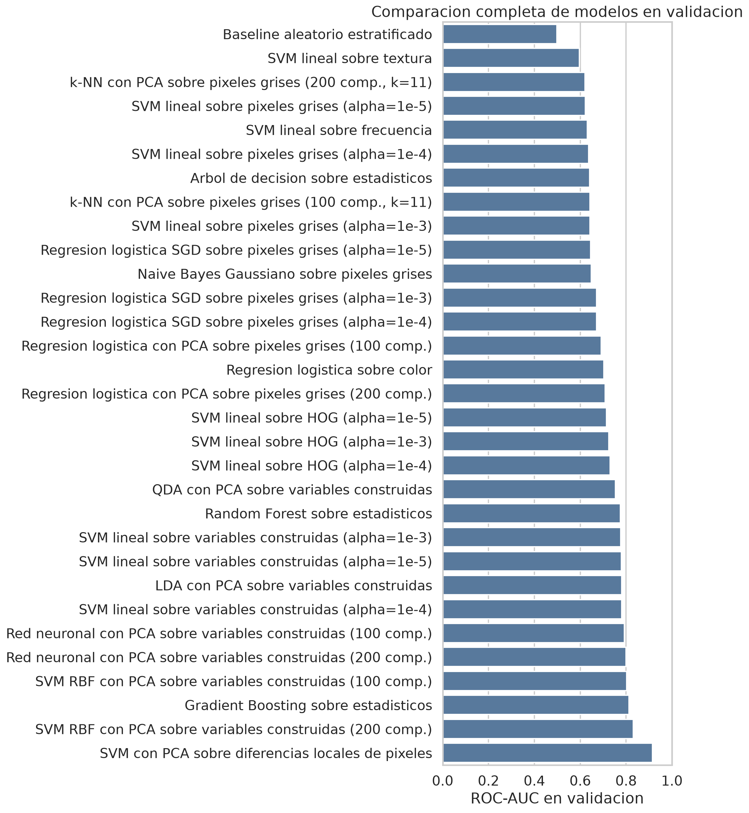

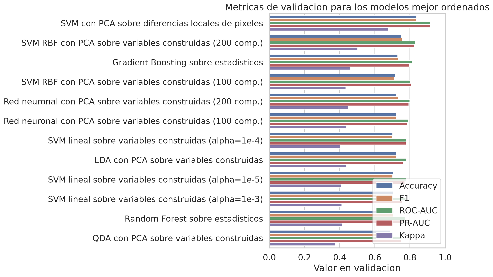

La comparación inicial, antes de agregar diferencias locales de píxeles, dejaba como mejor candidato a la **SVM RBF con PCA sobre variables construidas y 200 componentes**. Luego, la representación de diferencias locales mejoró claramente ese resultado en validación.

## Evaluación final en test

Como las clases están balanceadas, accuracy es informativa, pero no alcanza sola. También se reportan precision, recall, F1, ROC-AUC, PR-AUC y Kappa.

El test no se usó para comparar los 31 candidatos. Se usó al final sobre dos modelos: el mejor candidato de la comparación inicial y el modelo con diferencias locales de píxeles. Esto evita seleccionar modelos mirando el conjunto de test.

| Modelo | Accuracy | F1 | ROC-AUC | PR-AUC | Kappa |
| --- | ---: | ---: | ---: | ---: | ---: |
| SVM con PCA sobre variables construidas | 0.743 | 0.749 | 0.817 | 0.814 | 0.487 |
| SVM con PCA sobre diferencias locales de píxeles | 0.821 | 0.820 | 0.905 | 0.907 | 0.641 |

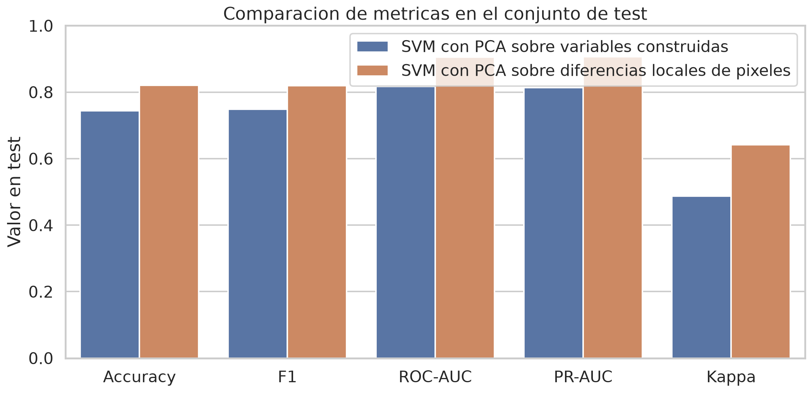

La segunda representación mejora todas las métricas principales. La diferencia en accuracy es de aproximadamente **7,7 puntos porcentuales**. También suben ROC-AUC y PR-AUC, lo que indica que el score del clasificador ordena mejor las imágenes reales y generadas.

La matriz de confusión del modelo final en test fue:

| Clase real / predicha | Real | Generada |
| --- | ---: | ---: |
| Real | 1.238 | 261 |
| Generada | 277 | 1.222 |

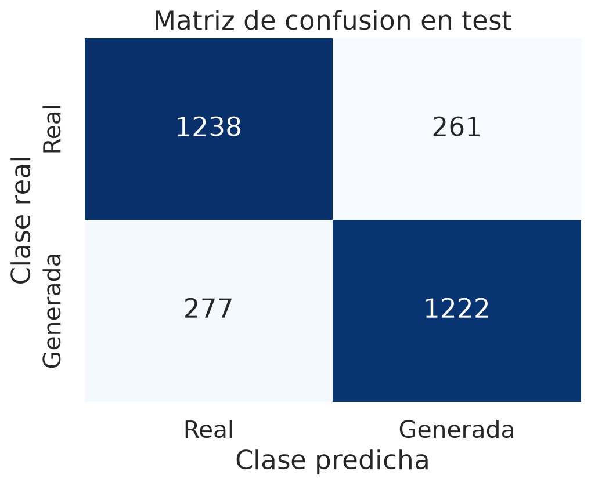

Sobre 2.998 imágenes de test, el modelo acierta 2.460 y se equivoca en 538. Los errores están bastante repartidos entre ambas clases: 261 imágenes reales fueron clasificadas como generadas y 277 imágenes generadas fueron clasificadas como reales.

Las curvas ROC y Precision-Recall muestran el comportamiento al variar el umbral de decisión:

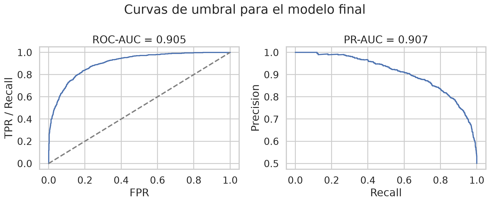

La distribución de scores muestra dos grupos desplazados, pero con solapamiento alrededor de la zona de decisión. Ese solapamiento explica los falsos positivos y falsos negativos.

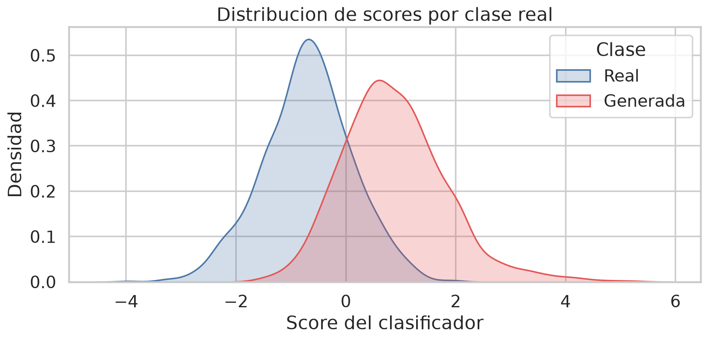

La proyección sobre las dos primeras componentes principales no separa perfectamente las clases. Esto no contradice el rendimiento del modelo: la SVM decide en el espacio de 128 componentes, no solamente en este plano 2D.

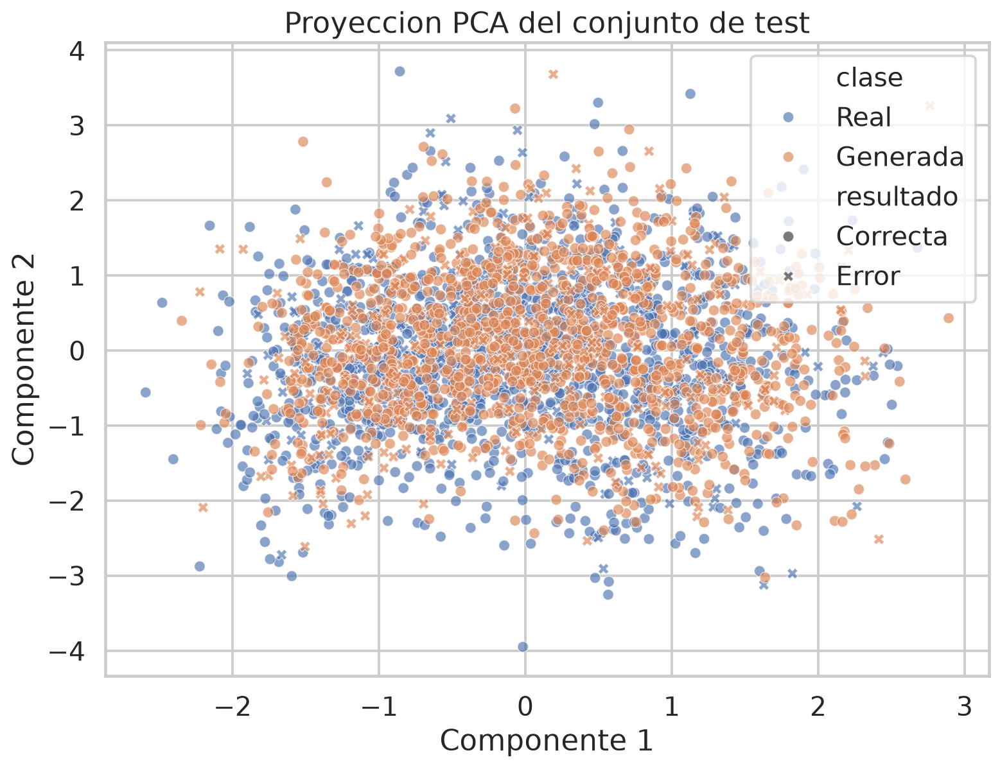

## Interpretación

El resultado sugiere que, para este dataset, la información más útil no está solamente en color global, textura general o gradientes de forma. La señal más fuerte aparece al mirar relaciones locales entre píxeles. Esa representación aumenta la dimensión, pero después PCA con whitening reduce y reescala el espacio antes de la SVM.

La SVM con kernel RBF es adecuada porque aprende una frontera no lineal. Conceptualmente, combina:

- transformación del espacio de variables;
- control de complejidad por regularización;
- selección empírica con validación;
- evaluación fuera de muestra en test.

Kappa = 0.641 indica que el acuerdo entre predicción y etiqueta está claramente por encima del azar. Como el dataset está balanceado, Kappa acompaña a accuracy, pero sigue siendo útil para mostrar que el clasificador no gana solamente por seguir la frecuencia mayoritaria.

## Limitaciones

El test proviene del mismo dataset que entrenamiento y validación. Por lo tanto, el resultado estima generalización dentro de esta distribución de imágenes. No alcanza para afirmar el mismo rendimiento sobre otros generadores, otras resoluciones, recortes distintos, compresión fuerte o imágenes tomadas de otra fuente.

El umbral final fue elegido usando validación para maximizar accuracy. Si el problema asignara costos distintos a los falsos positivos y falsos negativos, convendría elegir otro umbral mirando las curvas ROC y Precision-Recall.

PCA conserva direcciones de alta varianza, no necesariamente direcciones de máxima separación entre clases. En este trabajo funcionó como parte de un pipeline validado empíricamente, no como garantía teórica de separabilidad.

## Conclusión

El pipeline completo confirma que la representación de las imágenes es decisiva. Con variables generales de color, textura, gradiente y frecuencia, la SVM con PCA llega a 0.743 de accuracy en test. Al usar diferencias locales entre píxeles, la SVM con PCA sube a 0.821 de accuracy y mejora también F1, ROC-AUC, PR-AUC y Kappa.

El modelo final no es perfecto, pero generaliza mejor que las alternativas probadas bajo la partición fijada. La evidencia principal está en el test reservado y en las curvas de umbral, no en el error de entrenamiento ni en una visualización de dos dimensiones.

## Referencia

Nataraj, L., Mohammed, T. M., Chandrasekaran, S., Flenner, A., Bappy, J. H., Roy-Chowdhury, A. K. y Manjunath, B. S. (2019). *Detecting GAN generated Fake Images using Co-occurrence Matrices*. arXiv:1903.06836. https://doi.org/10.48550/arXiv.1903.06836

## Archivos generados

Tablas:

- `reports/tables/dataset_particiones.csv`
- `reports/tables/dimensiones_variables.csv`
- `reports/tables/validacion_modelos.csv`
- `reports/tables/metricas_test.csv`

Figuras:

- `reports/figures/01_distribucion_clases.png`
- `reports/figures/02_ejemplos_imagenes.png`
- `reports/figures/03_dimension_variables.png`
- `reports/figures/04_metricas_test.png`
- `reports/figures/05_matriz_confusion.png`
- `reports/figures/06_curvas_roc_pr.png`
- `reports/figures/07_scores_por_clase.png`
- `reports/figures/08_proyeccion_pca_test.png`
- `reports/figures/09_diferencias_locales.png`
- `reports/figures/10_validacion_roc_auc_modelos.png`
- `reports/figures/11_validacion_metricas_top12.png`
